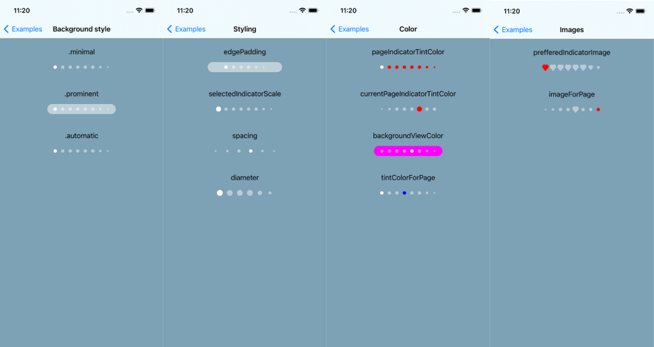

# PFPageControl


PFPageControl is a page control inspired by the iOS 14 UIPageControl that you can use in your < iOS 14 projects. It comes with some extra customizability options. 



## Requirements

-   Xcode 12.
-   Swift 5.
-   iOS 12 or higher.

## Example

To run the example project, clone the repo, select PFPageControlExamples scheme and run the project.

## Installation

PFPageControl is available through [CocoaPods](https://cocoapods.org). To install
it, simply add the following line to your Podfile:

```ruby
pod 'PFPageControl'
```

## Usage

Import PFPageControl where you intend to use it, initialize the page control and add to view.

    import PFPageControl
    var pfPageControl = PFPageControl()
    view.addSubview(pfPageControl)

That's it, you are ready to start using PFPageControl!

## Code

### Customization

| parameter | description | default |
|--|--|--|
| **numberOfPages** | Number of pages | Int: 0 |
| **currentPage** | Current page. Value is pinned to 0..numberOfPages-1 | Int: 0 |
| **pageIndicatorTintColor** | The tint color for non-selected indicators | UIColor: White with 0.45 alpha |
| **currentPageIndicatorTintColor** | The tint color for the currently-selected indicator | UIColor: White |
| **edgePadding** | Padding on left and right side of dot views | CGFloat: 15 |
| **spacing** | Spacing between dots | CGFloat: 10 |
| **diameter** | Regulates dots dimensions | CGFloat: 8 |
| **selectedIndicatorScale** | Scale for currently-selected indicator | CGFloat: 1 |
| **gestureEventsEnabled** | Enables/disables gestures | Bool: True |
| **allowsContinuousInteraction** | Enables/disables continues interacton | Bool: True |
| **backgroundViewColor** | The background color of the background view | UIColor: White with 0.5 alpha |
| **backgroundStyle** | The preferred background style (.minimal, .automatic, .prominent) | BackgroundStyle: .automatic |
| **hidesForSinglePage** | Hides the indicator if there is only one page | Bool: False |
| **preferredIndicatorImage** | The preferred image for indicators. Symbol images are recommended | UIImage?: nil |

### Methods

| method | description |
|--|--|
| **nextPage()** | currentPage += 1 |
| **prevPage()** | currentPage -= 1 |
| **setTintColor(color: UIColor, forPage index: Int)** | Sets tintColor for specific index |
| **setCurrentPageTintColor(color: UIColor, forPage index: Int)** | Sets tintColor for specific index when that page is current |
| **size(forNumberOfPages pageCount: Int) -> CGSize** | Returns the minimum size required to display indicators for the given page count |
| **setIndicatorImage(_ image: UIImage?, forPage page: Int)** | Override the indicator image for a specific page |

## PFPageControlDelegate

| delegate method | description |
|--|--|
| **didTapPreviousPage()** | Called when the user taps on the previous page |
| **didTapNextPage()** | Called when the user taps on the next page |

## Author

Ivan Ferenčak, iferencak@profico.hr
Profico, https://profi.co

## License

PFPageControl is available under the MIT license. See the LICENSE file for more info.
